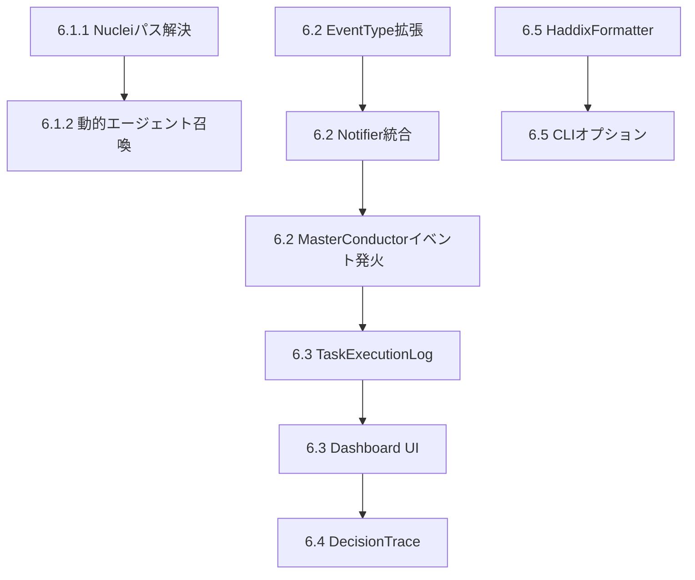

# Phase 6: 検出最適化と運用品質向上

> **Target**: `docs/IMPLEMENTATION_ROADMAP.md` の Phase 6 (6.1-6.5)

---

## 概要

DVWAスキャン（2026-02-06）で判明した問題を解決する。

**検出できた脆弱性**: LFI, Unrestricted File Upload, RCE Chain, PHP Info Disclosure, DVWA Default Login
**未検出の脆弱性**: Brute Force, OS Command Injection, CSRF, SQLi, Weak Session IDs, etc.

**主な原因**:

1. Nucleiテンプレートパスエラー (`no templates provided`)
2. `login.php` 発見後も `AuthNinja` が起動されなかった
3. 軽量スキャンのみで深掘りツール未起動

---

## 今回のスコープ (Phase 6 全体)

| 項目                       | 説明                                 | 優先度       |
| -------------------------- | ------------------------------------ | ------------ |
| 6.1 脆弱性検出の網羅性向上 | Nucleiパス解決、動的エージェント召喚 | **Critical** |
| 6.2 Granular Notification  | 詳細通知システム                     | High         |
| 6.3 Dashboard Traceability | 実行履歴トレース                     | Medium       |
| 6.4 Decision Log           | MasterConductor判断記録              | Medium       |
| 6.5 Haddix Report          | Bug Bounty最適化レポート             | Medium       |

---

## 変更ファイル

### 6.1 脆弱性検出の網羅性向上

#### [MODIFY] [nuclei.py](file:///home/bbb/Documents/App/Shigoku/src/tools/custom/nuclei.py)

- Dockerコンテナ対応のテンプレートパス解決を強化
- タグ指定エラー時のフォールバック機構追加
- プリフライトチェック（テンプレート存在確認）追加

#### [MODIFY] [master_conductor.py](file:///home/bbb/Documents/App/Shigoku/src/core/engine/master_conductor.py)

- 動的エージェント召喚ルール追加:
  - `login.php` 検出 → `AuthNinja` 自動召喚
  - フォームパラメータ検出 → SQLi Hunter 召喚

---

### 6.2 Granular Notification System

#### [MODIFY] [event_bus.py](file:///home/bbb/Documents/App/Shigoku/src/core/infra/event_bus.py)

- 新規 EventType 追加:
  - `SCAN_STARTED`, `VULN_HUNTING`, `VULN_NOT_FOUND`, `AGENT_DISPATCHED`
  - (`VULN_FOUND` は既存)

#### [MODIFY] [notifier.py](file:///home/bbb/Documents/App/Shigoku/src/core/notifications/notifier.py)

- `notify_event()` メソッド追加（EventType対応）
- フィルタリング設定（`SHIGOKU_NOTIFY_LEVEL`）

#### [MODIFY] [master_conductor.py](file:///home/bbb/Documents/App/Shigoku/src/core/engine/master_conductor.py)

- タスク開始時に `SCAN_STARTED` / `VULN_HUNTING` イベント発火
- タスク終了時に `VULN_FOUND` or `VULN_NOT_FOUND` イベント発火

---

### 6.3 Dashboard Traceability

#### [NEW] [task_execution_log.py](file:///home/bbb/Documents/App/Shigoku/src/core/models/task_execution_log.py)

- `TaskExecutionRecord` データモデル定義
- JSONL形式での永続化ロジック

#### [MODIFY] [master_conductor.py](file:///home/bbb/Documents/App/Shigoku/src/core/engine/master_conductor.py)

- タスク実行前後で `TaskExecutionRecord` 生成・保存

#### [MODIFY] [html_generator.py](file:///home/bbb/Documents/App/Shigoku/src/reports/html_generator.py)

- "Execution Trace" タブ追加
- ツリー表示・タイムライン表示

---

### 6.4 Decision Log

#### [NEW] [decision_trace.py](file:///home/bbb/Documents/App/Shigoku/src/core/models/decision_trace.py)

- `DecisionTrace` データモデル定義

#### [MODIFY] [master_conductor.py](file:///home/bbb/Documents/App/Shigoku/src/core/engine/master_conductor.py)

- 判断ポイントで `DecisionTrace` 記録

---

### 6.5 Jason Haddix Report Format

#### [NEW] [haddix_formatter.py](file:///home/bbb/Documents/App/Shigoku/src/reporting/haddix_formatter.py)

- Finding → Haddix形式変換
- PoC自動生成（curlコマンド）

#### [MODIFY] [main.py](file:///home/bbb/Documents/App/Shigoku/src/main.py)

- `--report-format haddix` オプション追加

---

## 検証計画

### 自動テスト

1. **Nucleiパス解決テスト** (既存: `tests/manual/test_nuclei_path_resolution.py`)

   ```bash
   pytest tests/manual/test_nuclei_path_resolution.py -v
   ```

2. **EventBusテスト** (新規作成予定)
   - 新規 EventType が正しく発火・購読されることを確認

   ```bash
   pytest tests/core/infra/test_event_bus.py -v
   ```

3. **Notifierテスト** (新規作成予定)
   - `notify_event()` がフィルタリング設定に従うことを確認

### E2E検証

1. **DVWA再スキャン**

   ```bash
   docker compose run --rm shigoku python3 -m src.main \
     --target "http://localhost:4280/" \
     --mode bugbounty \
     --live-dashboard
   ```

   - 確認項目:
     - `AuthNinja` が起動されること
     - Nucleiテンプレートエラーが解消されること
     - `SCAN_STARTED`, `VULN_HUNTING` イベントが発火されること

2. **Haddixレポート出力**
   ```bash
   docker compose run --rm shigoku python3 -m src.main \
     --report \
     --target "http://localhost:4280/" \
     --report-format haddix
   ```

---

## 実装順序


