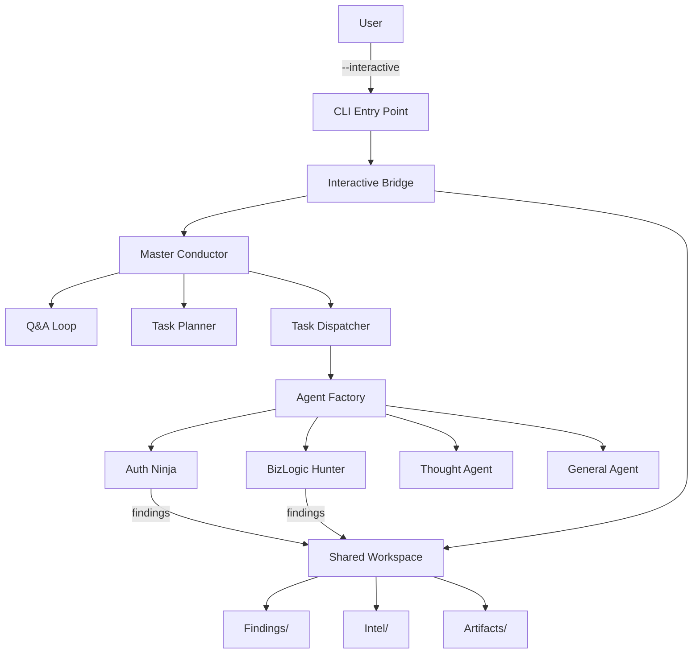

# SHIGOKU 統合アーキテクチャ

**更新日:** 2025-12-24  
**バージョン:** 2.0 (Master Conductor 統合版)

---

## 概要

SHIGOKU 2.0 では、従来の独立した CLI ツールから、**Master Conductor**を中心とした統合アーキテクチャに進化しました。

---

## アーキテクチャ全体図



---

## コンポーネント説明

### 1. Entry Point Layer

| コンポーネント        | 役割                         | ファイル                                   |
| --------------------- | ---------------------------- | ------------------------------------------ |
| **CLI**               | ユーザーインターフェース     | `src/main.py`, `src/__main__.py`           |
| **InteractiveBridge** | CLI-Conductor 間の双方向通信 | `src/core/conductor/interactive_bridge.py` |

### 2. Core Brain Layer

| コンポーネント       | 役割                               | ファイル                              |
| -------------------- | ---------------------------------- | ------------------------------------- |
| **Master Conductor** | タスク管理・オーケストレーション   | `src/core/engine/master_conductor.py` |
| **Q&A 機構**         | モード別質問生成・コンテキスト構築 | MasterConductor 内                    |
| **Task Planner**     | 実行プラン生成                     | MasterConductor 内                    |
| **Task Dispatcher**  | エージェントへのタスク割り当て     | MasterConductor.\_dispatch()          |

### 3. Agent Factory Layer

| コンポーネント       | 役割                   | ファイル              |
| -------------------- | ---------------------- | --------------------- |
| **AgentFactory**     | 動的エージェント生成   | `src/core/factory.py` |
| **登録エージェント** | 7 種類のエージェント型 | -                     |

**登録エージェント一覧:**

1. JWTInspector (AuthNinja)
2. OAuthDancer (AuthNinja)
3. SessionHijacker (AuthNinja)
4. BizLogicHunter (Swarm)
5. ThoughtAgent (Router)
6. ScopeParser (General)
7. Fingerprinter (General)

### 4. Agent Execution Layer

| エージェント       | 機能                   | ファイル                               |
| ------------------ | ---------------------- | -------------------------------------- |
| **AuthNinja**      | JWT/OAuth 認証バイパス | `src/agents/swarm/auth_ninja.py`       |
| **BizLogicHunter** | IDOR/権限昇格検証      | `src/agents/swarm/biz_logic_hunter.py` |
| **ThoughtAgent**   | タスクルーティング     | `src/core/agents/thought.py`           |
| **GeneralAgent**   | 汎用エージェント       | `src/core/agents/general.py`           |

### 5. Data Persistence Layer

| コンポーネント      | 役割               | ファイル                                 |
| ------------------- | ------------------ | ---------------------------------------- |
| **SharedWorkspace** | 統一ワークスペース | `src/core/workspace/shared_workspace.py` |

**ディレクトリ構造:**

※ 以下は `~/.shigoku/workspace/` 配下の実行ワークスペース構造です（リポジトリ直下ではありません）。

```
~/.shigoku/workspace/
├── findings/       # 脆弱性発見
├── intel/          # 偵察結果
├── artifacts/      # PoC, スクリプト
├── context/        # Handoff履歴
└── session/        # セッション情報
```

---

## 実行フロー (11 ステップワークフロー)

```
1. CLI起動
   ↓
2. モード選択 (bugbounty/ctf/vulntest)
   ↓
3. MasterConductorとチャット開始
   ↓
4. 課題入力 (ターゲットURL)
   ↓
5-7. Q&Aループ (5質問)
   - プログラム名
   - スコープファイル
   - 注力する脆弱性タイプ
   - 過去の報告履歴
   ↓
8. プランニング・タスク作成
   - Scope Verification
   - Deep Reconnaissance
   - Technology Fingerprinting
   ↓
9a. サブエージェントディスパッチ
   - AgentFactoryでエージェント作成
   - execute() または process() 実行
   ↓
9b. 共有フォルダー配置
   - SharedWorkspaceに保存
   ↓
10. Handoffからプラン修正
   - エージェントからのコンテキスト反映
   ↓
11. 繰り返しループ
   - 次のタスクへ
```

---

## Mode 別の動作

### bugbounty モード

- **優先度:** 安全性・品質
- **質問例:**
  - Bug Bounty プログラム名は？
  - スコープファイルは？
  - 注力したい脆弱性タイプは？
  - 過去に報告済みの脆弱性タイプは？

### ctf モード

- **優先度:** 速度
- **質問例:**
  - 問題文を入力してください
  - ヒントはありますか？
  - 制限事項は？

### vulntest モード

- **優先度:** 学習効果
- **質問例:**
  - 診断範囲（スコープ）を入力
  - 認証情報は提供されていますか？
  - 除外すべきエンドポイントは？

---

## Handoff 機構

### HandoffContext

エージェント間でコンテキストを受け渡すためのデータ構造:

```python
class HandoffContext:
    result: AuthBypassResult
    bypass_method: str
    credentials: dict
    recommendations: list[str]
    discovered_info: dict
    success_probability: float
    finding: Optional[Finding]
```

### Handoff フロー

```
SubAgent.execute()
    ↓
HandoffContext生成
    ↓
MasterConductor.inject_context()
    ↓
次のタスクにコンテキスト反映
```

---

## 新機能 (2.0)

### 1. InteractiveBridge

- CLI-MasterConductor 間の双方向通信
- モード選択
- ターゲット入力
- Q&A ループ
- 実行確認
- 結果サマリー表示

### 2. MasterConductor Q&A 機構

- モード別質問生成 (`generate_clarifying_questions()`)
- コンテキスト更新 (`update_context()`)
- 情報充足判定 (`has_sufficient_context()`)

### 3. MasterConductor Dispatch

- AgentFactory 連携
- execute()/process()の適切な呼び分け
- SharedWorkspace 自動保存
- エラーハンドリング

### 4. SharedWorkspace

- 統一ワークスペース
- セッション管理
- Finding/Intel/Artifact 保存
- サマリー生成

---

## 後方互換性

### レガシーモード

従来のプロキシログ解析方式も `--legacy` フラグで利用可能:

```bash
python -m src.main --legacy --mode bugbounty --log caido.json
```

---

## 実装状況

| Phase   | 達成率 | 詳細                                  |
| ------- | ------ | ------------------------------------- |
| Phase 0 | 100%   | SharedWorkspace, エントリポイント統一 |
| Phase 1 | 100%   | InteractiveBridge, Q&A 機構           |
| Phase 2 | 100%   | Dispatch 実装, AgentFactory 拡張      |
| Phase 3 | 100%   | AuthNinja, BizLogicHunter 統合        |

**全体達成率: 100%**

---

## テスト状況

### 統合テスト

- ✅ Phase 0: SharedWorkspace
- ✅ Phase 1: MasterConductor Q&A
- ✅ Phase 1: InteractiveBridge
- ✅ Phase 2: AgentFactory
- ✅ Phase 2: MasterConductor Dispatch
- ✅ Phase 3: AuthNinja 統合
- ✅ Phase 3: BizLogicHunter 統合

**テスト結果: 7/7 PASSED**

---

## 使用例

### インタラクティブセッション

```bash
$ python -m src.main --interactive --mode bugbounty

╔═══════════════════════════════════════════════════════════╗
║  SHIGOKU (至極) - Autonomous Security Hunter        ║
║  Powered by Master Conductor + Agent Swarm          ║
╚═══════════════════════════════════════════════════════════╝

Select Mode:
Choose mode [bugbounty/ctf/vulntest]: bugbounty

Target Information:
Enter target URL or domain: example.com

Q1: ターゲット 'example.com' で間違いありませんか？(Y/N)
Your answer: Y

Q2: Bug Bountyプログラム名は何ですか？
Your answer: Example Program

...

Execution Plan
┌────────────┬─────────────────────┬──────────────┬──────────┐
│ ID         │ Task                │ Agent        │ Priority │
├────────────┼─────────────────────┼──────────────┼──────────┤
│ task_001   │ Scope Verification  │ scope_parser │ 100      │
│ task_002   │ Deep Reconnaissance │ recon        │ 90       │
└────────────┴─────────────────────┴──────────────┴──────────┘

Proceed with execution? (Y/N): Y

🚀 Starting execution...
✓ Execution completed

📊 Session Summary
Findings         3
Intel Records    5
Artifacts        2
```

---

## 今後の拡張

- [ ] WebUI ダッシュボード統合
- [ ] RAG システムとの深い統合
- [ ] カスタムエージェント開発 SDK
- [ ] クラウドワークスペース同期

---

**作成者:** Antigravity Team  
**ライセンス:** MIT
