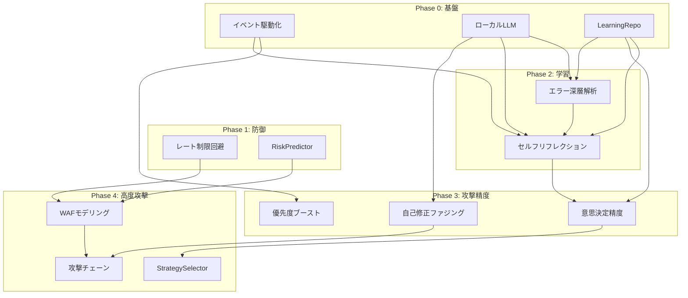

# SHIGOKU 機能拡張マスタープラン

**作成日:** 2026-01-03  
**対象:** AI 提案 15 機能 + 追加検討 5 機能

---

## 概要

本プランは、SHIGOKU の能力を最大化するための機能拡張ロードマップを定義する。各機能を多面的に評価し、リスクと効果のバランスを考慮して実装順序を決定した。

---

## 評価基準

| 評価軸         | スケール | 説明                                  |
| -------------- | -------- | ------------------------------------- |
| **効果**       | 1-5      | ビジネス価値・攻撃成功率への寄与度    |
| **実装難易度** | 1-5      | 1=容易, 5=非常に困難                  |
| **懸念度**     | 1-5      | バグ発生・副作用リスクの高さ          |
| **シナジー**   | 1-5      | 他機能との相乗効果                    |
| **ROI**        | 計算値   | (効果 × シナジー) / (難易度 + 懸念度) |

---

## 全機能評価マトリクス

### 採用候補

| #   | 機能名               | 効果 | 難易度 | 懸念度 | シナジー | ROI     | 判定       |
| --- | -------------------- | ---- | ------ | ------ | -------- | ------- | ---------- |
| 5   | イベント駆動化       | 4    | 2      | 2      | 5        | **5.0** | ✅ Phase 0 |
| 8   | ローカル LLM 活用    | 4    | 2      | 2      | 5        | **5.0** | ✅ Phase 0 |
| N1  | LearningRepository   | 4    | 2      | 2      | 5        | **5.0** | ✅ Phase 0 |
| 13  | レート制限回避       | 5    | 2      | 2      | 4        | **5.0** | ✅ Phase 1 |
| 7   | セルフリフレクション | 4    | 3      | 2      | 4        | **3.2** | ✅ Phase 2 |
| 4   | エラー深層解析       | 4    | 3      | 2      | 4        | **3.2** | ✅ Phase 2 |
| 9   | 失敗原因推論         | 3    | 2      | 2      | 4        | **3.0** | ✅ Phase 2 |
| 10  | 動的優先度ブースト   | 4    | 2      | 2      | 3        | **3.0** | ✅ Phase 3 |
| 11  | 意思決定精度向上     | 4    | 3      | 2      | 3        | **2.4** | ✅ Phase 3 |
| 3   | 自己修正型ファジング | 4    | 3      | 3      | 3        | **2.0** | ✅ Phase 3 |
| 1   | WAF モデリング       | 4    | 3      | 2      | 3        | **2.4** | ✅ Phase 4 |
| 14  | 攻撃チェーン生成     | 5    | 4      | 3      | 3        | **2.1** | ✅ Phase 4 |
| N2  | RiskPredictor        | 4    | 3      | 3      | 4        | **2.7** | ✅ Phase 1 |
| N3  | StrategySelector     | 4    | 3      | 3      | 4        | **2.7** | ✅ Phase 4 |

### 検討外（プラン外）

| #   | 機能名                   | 効果 | 難易度 | 懸念度 | 理由                                                        |
| --- | ------------------------ | ---- | ------ | ------ | ----------------------------------------------------------- |
| 2   | WAF/フィルタ回避強化学習 | 4    | 5      | 4      | GA/RL の収束不安定、リクエスト爆発リスク、デバッグ困難      |
| 6   | スウォーム協調           | 4    | 5      | 4      | 分散システムの複雑性、デッドロック/レースコンディション多発 |
| 12  | 動的エージェント生成     | 3    | 5      | 5      | LLM コード生成のセキュリティリスク、予測不能な動作          |
| N4  | ContextGraph             | 4    | 4      | 4      | Neo4j 依存の運用負担、グラフ整合性維持の困難さ              |
| N5  | MetaLearningLayer        | 4    | 4      | 4      | 転移学習の効果検証困難、過学習リスク                        |

---

## フェーズ別実装計画

### Phase 0: 基盤インフラ（推定工数: 2 週間）

> **目的:** 後続フェーズの効果を最大化するインフラ構築

#### 5. イベント駆動化

```
┌─────────────────────────────────────────────────────┐
│ 現状                                                │
│ MasterConductor → 同期呼び出し → Agent             │
│                                                     │
│ 改善後                                              │
│ Agent ──[EVENT]──→ EventBus ──→ Subscriber        │
└─────────────────────────────────────────────────────┘
```

| 項目           | 内容                                         |
| -------------- | -------------------------------------------- |
| **メリット**   | 疎結合化、拡張容易、並列処理可能             |
| **デメリット** | イベント順序保証が複雑化                     |
| **実装内容**   | `asyncio.Queue`ベースのインプロセス EventBus |
| **ファイル**   | `[NEW] src/core/infra/event_bus.py`          |
| **懸念対策**   | イベント重複排除、順序保証ミドルウェア実装   |

#### 8. ローカル LLM 活用

| 項目           | 内容                                                                        |
| -------------- | --------------------------------------------------------------------------- |
| **メリット**   | API コスト 70%削減、レイテンシ改善                                          |
| **デメリット** | GPU/CPU リソース必要、品質低下リスク                                        |
| **実装内容**   | Ollama 統合、タスク複雑度ルーティング                                       |
| **ファイル**   | `[MODIFY] src/core/llm/router.py`<br>`[NEW] src/core/llm/local_provider.py` |
| **懸念対策**   | 品質閾値設定、クラウドフォールバック                                        |

#### N1. LearningRepository

| 項目           | 内容                                    |
| -------------- | --------------------------------------- |
| **メリット**   | 学習結果の永続化・共有、収束速度向上    |
| **デメリット** | ストレージ肥大化                        |
| **実装内容**   | SQLite/JSON ベースの軽量学習リポジトリ  |
| **ファイル**   | `[NEW] src/core/learning/repository.py` |
| **懸念対策**   | TTL 付き自動クリーンアップ              |

---

### Phase 1: 防御的能力（推定工数: 1.5 週間）

> **目的:** 検知回避、持続的テスト時間の延長

#### 13. レート制限回避

```python
# 概念設計
class AdaptiveRateLimiter:
    def detect_rate_limit(self, response, elapsed):
        return (
            response.status_code == 429 or
            elapsed > self.baseline * 2 or
            "rate limit" in response.text.lower()
        )

    def enter_stealth_mode(self):
        self.delay_multiplier = 3.0
        self.recovery_timer = 300  # seconds
```

| 項目           | 内容                                                                         |
| -------------- | ---------------------------------------------------------------------------- |
| **メリット**   | ブロック回避、テスト継続性向上                                               |
| **デメリット** | テスト速度低下                                                               |
| **実装内容**   | 適応型スロットリング + ステルスモード                                        |
| **ファイル**   | `[NEW] src/core/infra/rate_limiter.py`<br>`[MODIFY] src/core/http/client.py` |
| **懸念対策**   | ベースライン測定の正確性担保                                                 |

#### N2. RiskPredictor

| 項目           | 内容                                            |
| -------------- | ----------------------------------------------- |
| **メリット**   | 検知リスク事前評価、失敗コスト最小化            |
| **デメリット** | 予測精度に依存                                  |
| **実装内容**   | アクションリスクスコアリング                    |
| **ファイル**   | `[NEW] src/core/intelligence/risk_predictor.py` |
| **懸念対策**   | 保守的デフォルト設定                            |

---

### Phase 2: 学習・適応能力（推定工数: 2 週間）

> **目的:** 失敗からの学習、自己改善

#### 7. セルフリフレクション

```
┌─────────────────────────────────────────────────────┐
│ 失敗発生 → 決定木チェック → ログ解析 → LLM推論     │
│     ↓           Hit↓            Hit↓        ↓      │
│  フォールバック実行 ← ← ← ← ← ← ← ← ← ← ← ← ┘      │
└─────────────────────────────────────────────────────┘
```

| 項目           | 内容                                                                             |
| -------------- | -------------------------------------------------------------------------------- |
| **メリット**   | 自動リカバリ、人間介入削減                                                       |
| **デメリット** | 無限ループリスク                                                                 |
| **実装内容**   | 3 段階フォールバック（決定木 → ログ →LLM）                                       |
| **ファイル**   | `[MODIFY] src/core/agents/thought.py`<br>`[NEW] src/core/learning/reflection.py` |
| **懸念対策**   | リトライ上限(3 回)、バックオフ                                                   |

#### 4. エラー深層解析

| 項目           | 内容                                                                            |
| -------------- | ------------------------------------------------------------------------------- |
| **メリット**   | 未知エラーへの対応力向上                                                        |
| **デメリット** | LLM コスト増                                                                    |
| **実装内容**   | パターン DB 優先 + LLM フォールバック                                           |
| **ファイル**   | `[NEW] src/core/analysis/error_analyzer.py`<br>`[NEW] data/error_patterns.json` |
| **懸念対策**   | パターン DB のヒット率モニタリング                                              |

#### 9. 失敗原因推論 (7 と統合)

| 項目         | 内容                          |
| ------------ | ----------------------------- |
| **実装内容** | セルフリフレクション(7)に統合 |
| **備考**     | 個別実装は冗長なため統合      |

---

### Phase 3: 攻撃精度向上（推定工数: 2.5 週間）

> **目的:** ペイロード最適化、優先度最適化

#### 10. 動的優先度ブースト

```python
BOOST_TRIGGERS = {
    "admin_panel": 2.0,
    "api_endpoint": 1.5,
    "file_upload": 1.8,
    "debug_mode": 2.5,
}
```

| 項目           | 内容                                           |
| -------------- | ---------------------------------------------- |
| **メリット**   | 高価値ターゲットへの集中                       |
| **デメリット** | 過度なブーストでバランス崩壊                   |
| **実装内容**   | トリガーベース優先度乗算                       |
| **ファイル**   | `[MODIFY] src/core/engine/master_conductor.py` |
| **懸念対策**   | ブースト上限設定(max 3.0)                      |

#### 11. 意思決定精度向上

| 項目           | 内容                                                                               |
| -------------- | ---------------------------------------------------------------------------------- |
| **メリット**   | 期待値ベース最適化                                                                 |
| **デメリット** | 初期データ不足時の不安定さ                                                         |
| **実装内容**   | Thompson Sampling + 過去 ROI DB                                                    |
| **ファイル**   | `[NEW] src/core/intelligence/task_prioritizer.py`<br>`[NEW] data/vuln_roi_db.json` |
| **懸念対策**   | 探索(exploration)率 10%維持                                                        |

#### 3. 自己修正型ファジング

| 項目           | 内容                                        |
| -------------- | ------------------------------------------- |
| **メリット**   | コンテキスト認識ペイロード生成              |
| **デメリット** | 解析オーバーヘッド                          |
| **実装内容**   | 反射コンテキスト検出 + LLM 調整             |
| **ファイル**   | `[MODIFY] src/tools/custom/param_fuzzer.py` |
| **懸念対策**   | 解析タイムアウト設定                        |

---

### Phase 4: 高度な攻撃能力（推定工数: 3 週間）

> **目的:** チェーン攻撃、戦略的アプローチ

#### 1. WAF モデリング

```
フィンガープリントDB → ルールベース回避 → LLMフォールバック
```

| 項目           | 内容                                                                                                     |
| -------------- | -------------------------------------------------------------------------------------------------------- |
| **メリット**   | 既知 WAF への高精度回避                                                                                  |
| **デメリット** | DB 維持コスト                                                                                            |
| **実装内容**   | WAF フィンガープリント + テンプレート回避                                                                |
| **ファイル**   | `[NEW] src/core/waf/detector.py`<br>`[NEW] src/core/waf/bypasser.py`<br>`[NEW] data/waf_signatures.json` |
| **懸念対策**   | シグネチャ更新プロセス定義                                                                               |

#### 14. 攻撃チェーン生成

| 項目           | 内容                                                                                   |
| -------------- | -------------------------------------------------------------------------------------- |
| **メリット**   | 複合脆弱性の発見                                                                       |
| **デメリット** | 誤ったチェーン推論                                                                     |
| **実装内容**   | ルールベース → LLM 推論（2 段階）                                                      |
| **ファイル**   | `[NEW] src/core/intelligence/chain_builder.py`<br>`[NEW] data/attack_chain_rules.json` |
| **懸念対策**   | チェーン検証ステップ必須化                                                             |

#### N3. StrategySelector

| 項目           | 内容                                               |
| -------------- | -------------------------------------------------- |
| **メリット**   | ターゲット特性に応じた最適戦略                     |
| **デメリット** | ルール設計の労力                                   |
| **実装内容**   | ターゲット特性 → 戦略マッピング                    |
| **ファイル**   | `[NEW] src/core/intelligence/strategy_selector.py` |
| **懸念対策**   | デフォルト戦略の堅牢性                             |

---

## 検討外項目の詳細理由

### 2. WAF/フィルタ回避強化学習

| 懸念ポイント       | 詳細                                                       |
| ------------------ | ---------------------------------------------------------- |
| **収束不安定**     | GA/RL は探索空間が広く、実用的な時間内に収束しない可能性   |
| **リクエスト爆発** | 世代交代ごとに大量リクエストが発生し、レート制限発動リスク |
| **デバッグ困難**   | 非決定的動作により再現性のないバグが発生                   |
| **代替案**         | Phase 4 の WAF モデリングで 80%の効果を低リスクで達成可能  |

### 6. スウォーム協調

| 懸念ポイント                          | 詳細                                                       |
| ------------------------------------- | ---------------------------------------------------------- |
| **分散システム複雑性**                | コンセンサス、パーティション耐性など分散システム固有の問題 |
| **デッドロック/レースコンディション** | 複数エージェントの並列動作で競合状態が頻発                 |
| **デバッグ・テスト困難**              | 非決定的な動作順序により再現テストが困難                   |
| **代替案**                            | Phase 0 のイベント駆動化で疎結合な協調を実現               |

### 12. 動的エージェント生成

| 懸念ポイント           | 詳細                                           |
| ---------------------- | ---------------------------------------------- |
| **セキュリティリスク** | LLM が生成するコードの安全性を保証できない     |
| **予測不能動作**       | 生成されたエージェントの振る舞いが事前検証不可 |
| **デバッグ不可能**     | 動的生成コードのトレースが困難                 |
| **代替案**             | 既存 Recipe システムの拡張で十分な柔軟性を確保 |

### N4. ContextGraph (Neo4j)

| 懸念ポイント   | 詳細                                                           |
| -------------- | -------------------------------------------------------------- |
| **運用負担**   | Neo4j インスタンスの管理、バックアップ、スケーリング           |
| **整合性維持** | グラフデータの一貫性維持が複雑                                 |
| **学習曲線**   | Cypher クエリの習得コスト                                      |
| **代替案**     | LearningRepository と SharedWorkspace で基本的な知識共有を実現 |

### N5. MetaLearningLayer

| 懸念ポイント     | 詳細                                                   |
| ---------------- | ------------------------------------------------------ |
| **効果検証困難** | 転移学習の効果を定量評価する手法がない                 |
| **過学習リスク** | 特定ターゲットに過適合し汎用性喪失                     |
| **実装複雑性**   | 複数モジュール間のパターン抽出ロジックが複雑           |
| **代替案**       | Phase 2 の LearningRepository で基本的な学習共有を実現 |

---

## 依存関係グラフ



---

## 検証計画

### 自動テスト

各フェーズ完了時に以下を実行:

```bash
# 単体テスト
pytest tests/ -v --cov=src/

# 統合テスト
pytest tests/integration/ -v

# 型チェック
mypy src/ --strict
```

### 手動検証

| フェーズ | 検証内容             | 成功基準                          |
| -------- | -------------------- | --------------------------------- |
| Phase 0  | イベント発火確認     | ログでイベント伝播を確認          |
| Phase 1  | レート制限検知テスト | 429 応答でステルスモード移行      |
| Phase 2  | 失敗リカバリテスト   | 意図的失敗 → 自動リトライ成功     |
| Phase 3  | 優先度変動テスト     | admin 発見 → 関連タスク優先度上昇 |
| Phase 4  | WAF バイパステスト   | 既知 WAF 環境でバイパス成功率測定 |

---

## リスク管理

| リスク                   | 影響度 | 対策                               |
| ------------------------ | ------ | ---------------------------------- |
| ローカル LLM の品質不足  | 高     | クラウドフォールバック、品質閾値   |
| イベント順序問題         | 中     | シーケンス番号付与、タイムスタンプ |
| 過度な学習によるバイアス | 中     | 探索率維持、定期リセット           |
| 依存関係の複雑化         | 中     | フェーズ間の明確な境界             |

---

## 総工数見積もり

| フェーズ | 工数     | 累積     |
| -------- | -------- | -------- |
| Phase 0  | 2 週間   | 2 週間   |
| Phase 1  | 1.5 週間 | 3.5 週間 |
| Phase 2  | 2 週間   | 5.5 週間 |
| Phase 3  | 2.5 週間 | 8 週間   |
| Phase 4  | 3 週間   | 11 週間  |

**合計: 約 11 週間（2.5 ヶ月）**

---

## 次のステップ

1. 本プランのレビュー・承認
2. Phase 0 の詳細設計開始
3. 各フェーズ開始前に詳細実装計画を作成
