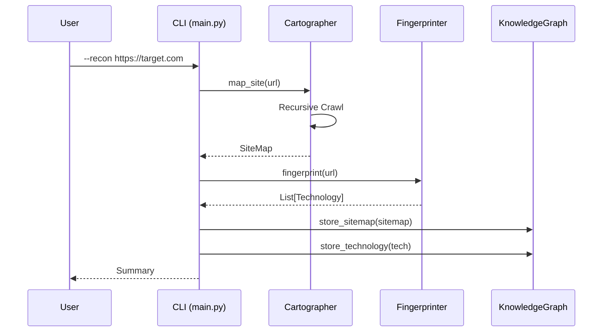
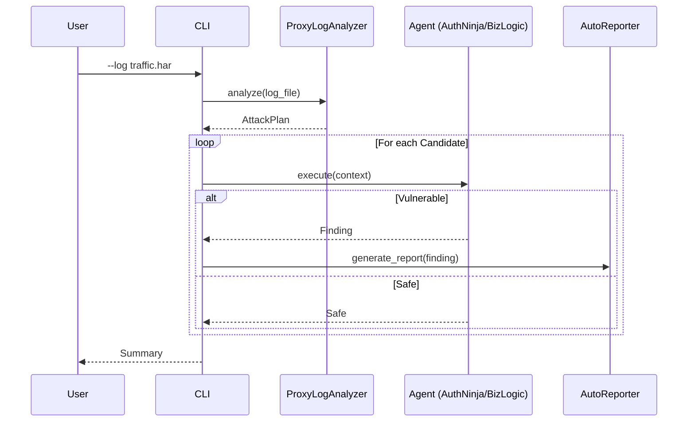

# 🧠 SHIGOKU 技術設計書

**SHIGOKU** の内部アーキテクチャ、データモデル、および自律性ロジックに関する詳細な技術仕様です。
開発者やコントリビューターがシステムの動作原理を理解するためのリファレンスです。

---

## 目次 (Table of Contents)

1. [システム概要](#1-システム概要)
2. [コンポーネント詳細](#2-コンポーネント詳細)
3. [データフロー](#3-データフロー)
4. [グラフスキーマ設計](#4-グラフスキーマ設計)
5. [エージェント連携プロトコル](#5-エージェント連携プロトコル)
6. [EthicsGuard 内部実装](#6-ethicsguard-内部実装)
7. [RAG パイプライン](#7-ragパイプライン)
8. [拡張ポイント](#8-拡張ポイント)

---

## 1. システム概要

### アーキテクチャ概念図

```
┌─────────────────────────────────────────────────────────────────────────────┐
│                              SHIGOKU SYSTEM                                  │
├─────────────────────────────────────────────────────────────────────────────┤
│                                                                             │
│  ┌───────────────────────────────────────────────────────────────────────┐  │
│  │                         PRESENTATION LAYER                            │  │
│  │  ┌─────────────┐   ┌─────────────┐   ┌────────────────────────────┐   │  │
│  │  │   CLI       │   │  Config     │   │   External Inputs          │   │  │
│  │  │  (main.py)  │   │  (YAML)     │   │   (Proxy Logs, Vault)      │   │  │
│  │  └──────┬──────┘   └──────┬──────┘   └─────────────┬──────────────┘   │  │
│  └─────────┼─────────────────┼─────────────────────────┼─────────────────┘  │
│            │                 │                         │                    │
│            ▼                 ▼                         ▼                    │
│  ┌───────────────────────────────────────────────────────────────────────┐  │
│  │                         ORCHESTRATION LAYER                           │  │
│  │  ┌──────────────────────────────────────────────────────────────────┐ │  │
│  │  │                    Master Conductor                              │ │  │
│  │  │  ┌─────────────┐  ┌─────────────┐  ┌─────────────────────────┐  │ │  │
│  │  │  │ Task Queue  │  │  Dispatcher │  │  Result Aggregator      │  │ │  │
│  │  │  └─────────────┘  └─────────────┘  └─────────────────────────┘  │ │  │
│  │  └──────────────────────────────────────────────────────────────────┘ │  │
│  └───────────────────────────────────────────────────────────────────────┘  │
│                    │                 │                 │                    │
│       ┌────────────┼─────────────────┼─────────────────┼────────────┐       │
│       ▼            ▼                 ▼                 ▼            ▼       │
│  ┌─────────┐ ┌─────────┐ ┌─────────────────┐ ┌─────────┐ ┌─────────────┐   │
│  │  INTEL  │ │ ACTION  │ │    SAFETY       │ │  DATA   │ │  KNOWLEDGE  │   │
│  │  LAYER  │ │ LAYER   │ │    LAYER        │ │  LAYER  │ │  LAYER      │   │
│  ├─────────┤ ├─────────┤ ├─────────────────┤ ├─────────┤ ├─────────────┤   │
│  │Cartogr. │ │AuthNinja│ │  EthicsGuard    │ │  Neo4j  │ │  ChromaDB   │   │
│  │Fingerpr.│ │BizLogic │ │  ┌───────────┐  │ │         │ │             │   │
│  │VisualF. │ │CommitW. │ │  │ScopeCheck │  │ │ Nodes   │ │ Vectors     │   │
│  │ProxyLog │ │Reporter │ │  │RateLimit  │  │ │Relations│ │ Metadata    │   │
│  │         │ │         │ │  │PathBlock  │  │ │         │ │             │   │
│  │         │ │         │ │  └───────────┘  │ │         │ │             │   │
│  └─────────┘ └─────────┘ └─────────────────┘ └─────────┘ └─────────────┘   │
│                                                                             │
└─────────────────────────────────────────────────────────────────────────────┘
```

### レイヤー責務

| レイヤー          | 責務                         | 主要クラス                        |
| :---------------- | :--------------------------- | :-------------------------------- |
| **Presentation**  | 入出力インターフェース       | `main.py`, YAML Parser            |
| **Orchestration** | タスク管理、エージェント派遣 | Master Conductor                  |
| **Intel**         | 情報収集、分析               | Cartographer, Fingerprinter, etc. |
| **Action**        | 攻撃実行、レポート生成       | AuthNinja, BizLogicHunter, etc.   |
| **Safety**        | 倫理的制約の強制             | EthicsGuard                       |
| **Data**          | 永続化、グラフ管理           | KnowledgeGraph (Neo4j)            |
| **Knowledge**     | ベクトル検索、RAG            | RAGSwitch (ChromaDB)              |

---

## 2. コンポーネント詳細

### 2-1. Master Conductor

**役割**: タスクのスケジューリングとエージェントの派遣

**内部状態**:

```python
class MasterConductor:
    def __init__(self):
        self.task_queue: Queue[Task] = Queue()
        self.active_agents: Dict[str, Agent] = {}
        self.results: List[Finding] = []
        self.ethics_guard: EthicsGuard
        self.knowledge_graph: KnowledgeGraph
        self.rag_switch: RAGSwitch
```

**派遣ロジック**:

```
1. ProxyLogAnalyzer から候補 (Candidate) を取得
2. 各候補の Smell タイプを確認
3. Smell に基づいて適切なエージェントを選択:
   - JWT_PRESENT → AuthNinja.JWTInspector
   - OAUTH_FLOW → AuthNinja.OAuthDancer
   - IDOR_CANDIDATE → BizLogicHunter
4. エージェントに Context を渡して実行
5. 結果 (Finding または Safe) を収集
6. Finding があれば AutoReporter に渡す
```

### 2-2. RotatingSession

**役割**: IP ローテーション付き HTTP クライアント

```python
class RotatingSession:
    def __init__(self, ethics_guard: EthicsGuard):
        self.ethics_guard = ethics_guard
        self.proxy_rotation = ProxyRotation()

    def request(self, method: str, url: str, **kwargs) -> Response:
        # 1. EthicsGuard チェック
        if not self.ethics_guard.is_allowed(url):
            raise ScopeViolationError(url)

        # 2. レート制限チェック
        self.ethics_guard.check_and_wait(urlparse(url).netloc)

        # 3. プロキシ設定
        proxy = self.proxy_rotation.get_next()

        # 4. リクエスト実行
        import httpx
        with httpx.Client(proxies=proxy) as client:
            return client.request(method, url, **kwargs)
```

---

## 3. データフロー

### Recon Mode フロー



### Hybrid Hunt フロー



---

## 4. グラフスキーマ設計

### ノード定義

```
┌─────────────────────────────────────────────────────────────────────────┐
│                           GRAPH SCHEMA                                   │
├─────────────────────────────────────────────────────────────────────────┤
│                                                                         │
│   ┌────────────┐         ┌────────────┐         ┌────────────┐         │
│   │  Domain    │─CONTAINS→│   Page     │─RUNS_ON→│ Technology │         │
│   │            │         │            │         │            │         │
│   │ name       │         │ url        │         │ name       │         │
│   │ ip_address │         │ method     │         │ version    │         │
│   │ is_in_scope│         │ status_code│         │ category   │         │
│   └────────────┘         │ page_type  │         └────────────┘         │
│                          │ depth      │                                 │
│                          └────────────┘                                 │
│                               │  │                                      │
│                    ┌──────────┘  └──────────┐                           │
│                    ▼                        ▼                           │
│              ┌────────────┐          ┌────────────┐                     │
│              │   Form     │          │  Finding   │                     │
│              │            │          │            │                     │
│              │ action     │          │ title      │                     │
│              │ method     │          │ severity   │                     │
│              │ inputs     │          │ vuln_type  │                     │
│              └────────────┘          │ report_path│                     │
│                                      └────────────┘                     │
│                                                                         │
│   Relationships:                                                        │
│   • (Domain)-[:CONTAINS]->(Page)                                        │
│   • (Page)-[:LINKS_TO]->(Page)                                          │
│   • (Page)-[:RUNS_ON]->(Technology)                                     │
│   • (Page)-[:HAS_FORM]->(Form)                                          │
│   • (Page)-[:HAS_VULNERABILITY]->(Finding)                              │
│                                                                         │
└─────────────────────────────────────────────────────────────────────────┘
```

### インデックス戦略

```cypher
-- パフォーマンス向上のためのインデックス
CREATE INDEX page_url_idx FOR (p:Page) ON (p.url);
CREATE INDEX domain_name_idx FOR (d:Domain) ON (d.name);
CREATE INDEX tech_name_idx FOR (t:Technology) ON (t.name);
CREATE INDEX finding_severity_idx FOR (f:Finding) ON (f.severity);
```

### 推論クエリ例

```cypher
-- High ROI ターゲット: WordPress + Admin Page
MATCH (p:Page)-[:RUNS_ON]->(t:Technology {name: 'WordPress'})
WHERE p.page_type = 'ADMIN' OR p.url CONTAINS 'wp-admin'
RETURN p.url, t.version
ORDER BY t.version ASC;  -- 古いバージョン優先

-- 認証なしで到達可能な管理画面
MATCH path = (public:Page)-[:LINKS_TO*1..3]->(admin:Page)
WHERE admin.page_type = 'ADMIN'
  AND public.page_type = 'CONTENT'
RETURN admin.url, length(path) as hops;
```

---

## 5. エージェント連携プロトコル

### HandoffContext / HandoffResult

エージェント間のデータ受け渡しに使用される標準フォーマット：

```python
@dataclass
class HandoffContext:
    target_url: str
    original_request: dict
    authentication: dict  # トークン、Cookie等
    rag_hints: List[str]  # RAGから取得したヒント
    metadata: dict

@dataclass
class HandoffResult:
    result: AgentResult  # SUCCESS / FAILURE / CONTINUE
    success_probability: float  # 0.0 - 1.0
    bypass_method: str  # 成功時の手法
    credentials: dict  # 取得した認証情報
    finding: Finding  # 生成された Finding (optional)
    discovered_info: str  # 追加情報
```

### エージェント基底クラス

```python
class BaseAgent(ABC):
    def __init__(self, ethics_guard: EthicsGuard, rag_switch: RAGSwitch = None):
        self.ethics_guard = ethics_guard
        self.rag_switch = rag_switch

    @abstractmethod
    def execute(self, target_url: str, context: dict) -> HandoffResult:
        """攻撃を実行し、結果を返す"""
        pass

    def _create_finding(self, title: str, severity: Severity,
                        vuln_type: VulnType, evidence: List[Evidence]) -> Finding:
        """Finding オブジェクトを生成"""
        pass
```

---

## 6. EthicsGuard 内部実装

### 判定フローチャート

```
                    ┌─────────────┐
                    │ HTTP Request│
                    └──────┬──────┘
                           │
                           ▼
                   ┌───────────────┐
              ┌────│ Out of Scope? │
              │    └───────────────┘
              │Yes         │No
              ▼            ▼
        ┌─────────┐  ┌───────────────┐
        │  BLOCK  │  │  In Scope?    │
        └─────────┘  └───────────────┘
                           │
              ┌────────────┼────────────┐
              │No          │Yes         │
              ▼            ▼            │
        ┌─────────┐  ┌───────────────┐  │
        │  BLOCK  │  │ Disallowed    │  │
        │(Default │  │ Path?         │  │
        │ Deny)   │  └───────────────┘  │
        └─────────┘        │            │
                      ┌────┼────┐       │
                      │Yes │No  │       │
                      ▼    ▼    │       │
                ┌─────────┐│    │       │
                │  BLOCK  ││    │       │
                └─────────┘│    │       │
                           │    │       │
                           ▼    ▼       │
                    ┌───────────────┐   │
                    │ Rate Limit OK?│   │
                    └───────────────┘   │
                           │            │
                      ┌────┼────┐       │
                      │No  │Yes │       │
                      ▼    ▼    │       │
                ┌─────────┐│    │       │
                │  WAIT   ││    │       │
                └─────────┘│    │       │
                           │    │       │
                           ▼    ▼       │
                    ┌───────────────┐   │
                    │    ALLOW      │←──┘
                    └───────────────┘
```

### トークンバケット実装

```python
class RateLimiter:
    def __init__(self, requests_per_minute: int = 60):
        self.capacity = requests_per_minute
        self.tokens = requests_per_minute
        self.last_refill = time.time()
        self.refill_rate = requests_per_minute / 60.0  # per second

    def acquire(self) -> bool:
        self._refill()
        if self.tokens >= 1:
            self.tokens -= 1
            return True
        return False

    def _refill(self):
        now = time.time()
        elapsed = now - self.last_refill
        self.tokens = min(self.capacity, self.tokens + elapsed * self.refill_rate)
        self.last_refill = now
```

---

## 7. RAG パイプライン

### インジェストフロー

```
Obsidian Vault
     │
     ▼
┌─────────────────┐
│ File Discovery  │ ← glob("**/*.md")
└────────┬────────┘
         │
         ▼
┌─────────────────┐
│ Markdown Parse  │ ← frontmatter, content, links
└────────┬────────┘
         │
         ▼
┌─────────────────┐
│ Chunk Split     │ ← 500 chars / 50 overlap
└────────┬────────┘
         │
         ▼
┌─────────────────┐
│ Embedding Gen   │ ← sentence-transformers
└────────┬────────┘
         │
         ▼
┌─────────────────┐
│ ChromaDB Store  │ ← vectors + metadata
└─────────────────┘
```

### クエリフロー

```python
def query(self, query_text: str, n_results: int = 5) -> List[dict]:
    # 1. クエリをベクトル化
    query_embedding = self.embed_model.encode(query_text)

    # 2. ChromaDB で類似検索
    results = self.collection.query(
        query_embeddings=[query_embedding],
        n_results=n_results,
        include=["documents", "metadatas", "distances"]
    )

    # 3. 結果を整形
    return [
        {
            "content": doc,
            "source": meta.get("source"),
            "distance": dist
        }
        for doc, meta, dist in zip(
            results["documents"][0],
            results["metadatas"][0],
            results["distances"][0]
        )
    ]
```

---

## 8. 拡張ポイント

### 新規エージェントの追加

1. `src/agents/swarm/` に新しいファイルを作成
2. `BaseAgent` を継承
3. `execute()` メソッドを実装
4. `__init__.py` にエクスポートを追加
5. Master Conductor に派遣ルールを追加

```python
# src/agents/swarm/new_agent.py
class NewAgent(BaseAgent):
    def execute(self, target_url: str, context: dict) -> HandoffResult:
        # 実装
        pass
```

### 新規 Smell タイプの追加

1. `SmellType` Enum に新しい値を追加
2. `SmellDetector` に検出ロジックを追加
3. 対応するエージェントと派遣ルールを設定

### カスタムシグネチャの追加

`Fingerprinter` にカスタムシグネチャを注入：

```python
custom_sig = Signature(
    name="InternalFramework",
    category=Category.FRAMEWORK,
    patterns=[
        {"type": "header", "name": "X-Internal", "regex": r"v(\d+)"}
    ]
)
fingerprinter = Fingerprinter(custom_signatures=[custom_sig])
```
