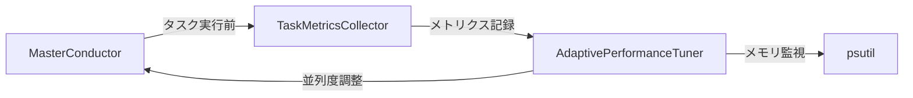

# 仕様書: AdaptivePerformanceTuner

## 概要

MasterConductorのタスク実行パフォーマンスを動的に最適化するモジュール。レイテンシ、メモリ、CPU使用率を監視し、並列度を自動調整します。

## 背景と問題

現在のSHIGOKUは静的な並列度設定（ツールごとに`concurrency=5~25`）を使用しており、以下の問題があります：

- 高負荷時にメモリ逼迫やタイムアウトが発生
- 低負荷時にリソースを活用しきれていない
- タスク実行速度が環境（ネットワーク、ターゲット応答性）に左右される

## 目標

1. **レイテンシベースの動的調整**: タスク実行時間に基づく並列度の自動増減
2. **メモリ安全性**: メモリ使用率85%超で並列度を半減
3. **透明性**: メトリクスをログ/ダッシュボードに可視化

## 設計

### 配置先

**新規モジュール**: `src/core/engine/adaptive_tuner.py`  
**理由**: `feedback_loop.py`はWAF解析専用モジュールであり、パフォーマンス管理とは責務が異なるため

### アーキテクチャ



### メトリクス収集ポイント

#### 1. TaskMetricsCollector (新規)

`MasterConductor._execute_task()`の前後でメトリクスを収集：

```python
@dataclass
class TaskMetrics:
    task_id: str
    start_time: float
    end_time: float
    success: bool
    memory_before_mb: float
    memory_after_mb: float

    @property
    def latency(self) -> float:
        return self.end_time - self.start_time
```

#### 2. 収集対象メトリクス

- `task_latency`: タスク実行時間（秒）
- `memory_usage`: 実行前後のメモリ差分（MB）
- `cpu_usage`: システムCPU使用率（`psutil.cpu_percent()`）
- `io_wait`: ~~削除~~ (非推奨: 測定が困難で信頼性が低い)

### 並列度制御対象

#### 現状の並列処理

1. **各ツールの`concurrency`パラメータ** (ffuf, nuclei等)
2. **`MasterConductor.task_queue`の並列実行** (未実装)

#### 提案: MasterConductor並列実行の導入

現在は`execute_with_replan()`でタスクを**直列実行**していますが、以下を導入：

```python
# src/core/engine/master_conductor.py
class MasterConductor:
    def __init__(self, ...):
        self._max_concurrent_tasks = 10  # ← AdaptiveTunerが動的調整
        self._task_semaphore = asyncio.Semaphore(self._max_concurrent_tasks)
```

**注意**: 単純な並列化は以下のリスクがあるため、Phase 1では**メトリクス収集のみ**実施：

- タスク間依存関係の考慮不足（例: Recon完了前にFuzzing開始）
- EthicsGuardのレート制限との競合

### チューニングアルゴリズム（改善版）

#### 問題点: 元の提案の課題

```python
# 元の提案
avg_latency = statistics.mean(self._metrics["task_latency"][-100:])
if avg_latency > self._target_latency * 1.5:
    self._current_concurrency = max(5, self._current_concurrency - 2)
```

**課題**:

- レイテンシの「絶対値」で判断 → タスク種類（Recon vs SQLi）で実行時間は全く異なる
- サンプル数100は時間軸を無視 → タスク実行速度によって意味が変わる

#### 改善案: Exponential Moving Average (EMA) + 相対的閾値

```python
class AdaptivePerformanceTuner:
    def __init__(self):
        self._ema_latency = None  # EMAによる移動平均
        self._alpha = 0.3  # EMA平滑化係数
        self._current_concurrency = 10
        self._min_concurrency = 5
        self._max_concurrency = 100

    def update_metrics(self, latency: float):
        """EMA更新"""
        if self._ema_latency is None:
            self._ema_latency = latency
        else:
            self._ema_latency = self._alpha * latency + (1 - self._alpha) * self._ema_latency

    async def tune(self):
        """並列度を動的調整"""
        if self._ema_latency is None:
            return  # データ不足

        # 戦略1: メモリ圧迫時は即座に半減
        mem_percent = psutil.virtual_memory().percent
        if mem_percent > 85:
            new_concurrency = max(self._min_concurrency, self._current_concurrency // 2)
            logger.warning(f"Memory pressure ({mem_percent}%) - reducing concurrency: {self._current_concurrency} -> {new_concurrency}")
            self._current_concurrency = new_concurrency
            return

        # 戦略2: レイテンシの「変化率」で判断
        # TODO: 基準レイテンシの動的学習ロジックを追加
        # 現時点ではEMA値そのものを基準とする
```

### GC戦略の変更

**削除**: `await self._trigger_gc()`  
**理由**:

- Pythonの自動GCは十分賢い
- 強制GCはSTW（Stop-The-World）を引き起こし逆効果
- メモリ逼迫時は並列度削減で対応

### データ保持期間

```python
@dataclass
class AdaptivePerformanceTuner:
    _metrics_history: deque = field(default_factory=lambda: deque(maxlen=1000))  # 最大1000件
    _metrics_ttl: int = 3600  # 1時間で古いデータを破棄

    def _cleanup_old_metrics(self):
        """古いメトリクスを削除"""
        cutoff_time = time.time() - self._metrics_ttl
        while self._metrics_history and self._metrics_history[0].timestamp < cutoff_time:
            self._metrics_history.popleft()
```

## 実装計画

### Phase 1: メトリクス収集基盤（今回実装）

- [ ] `src/core/engine/task_metrics.py` 新規作成
  - `TaskMetrics` dataclass
  - `TaskMetricsCollector` クラス
- [ ] `src/core/engine/adaptive_tuner.py` 新規作成
  - `AdaptivePerformanceTuner` クラス（メトリクス収集のみ、調整は未実装）
- [ ] `MasterConductor`への統合
  - `_execute_task()` 前後でメトリクス記録
  - ログ出力でメトリクスを可視化

### Phase 2: 動的調整（次回以降）

- [ ] 並列度調整ロジックの実装
- [ ] MasterConductorの並列実行機能追加（Semaphore導入）
- [ ] タスク依存関係の考慮

### Phase 3: 高度な最適化

- [ ] 機械学習ベースの予測モデル（過去データから最適並列度を学習）
- [ ] ダッシュボード統合（リアルタイムグラフ表示）

## 検証方法

### 単体テスト

```python
# tests/test_adaptive_tuner.py
def test_ema_calculation():
    tuner = AdaptivePerformanceTuner()
    tuner.update_metrics(1.0)
    assert tuner._ema_latency == 1.0

    tuner.update_metrics(2.0)
    expected = 0.3 * 2.0 + 0.7 * 1.0  # EMA計算
    assert abs(tuner._ema_latency - expected) < 0.01
```

### E2E検証

1. DVWA等のテスト環境で長時間実行
2. メトリクスログを確認（EMA推移、メモリ使用率）
3. 並列度調整の履歴を検証

## リスクと制約

### リスク

1. **過剰最適化**: 頻繁な調整がオーバーヘッドになる可能性
   - **対策**: 調整間隔を最低10タスクごとに制限
2. **タスク種類の多様性**: Recon（長時間）とSQLi（短時間）で最適値が異なる
   - **対策**: Phase 2でタスク種別ごとの最適化を検討

### 制約

- `psutil`の依存追加（軽量なので許容範囲）
- Python 3.7+ （型ヒント、dataclassを使用）

## 承認事項

> [!IMPORTANT]  
> 以下を確認してください：
>
> 1. **Phase 1のスコープ**: メトリクス収集のみで並列度調整は未実装（段階的導入）
> 2. **配置先**: `feedback_loop.py`ではなく新規モジュール
> 3. **GC戦略削除**: 強制GCは実装しない

承認後、Phase 1の実装を開始します。
